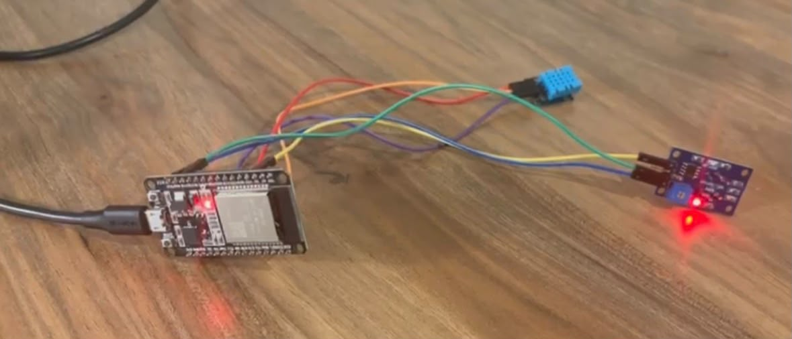
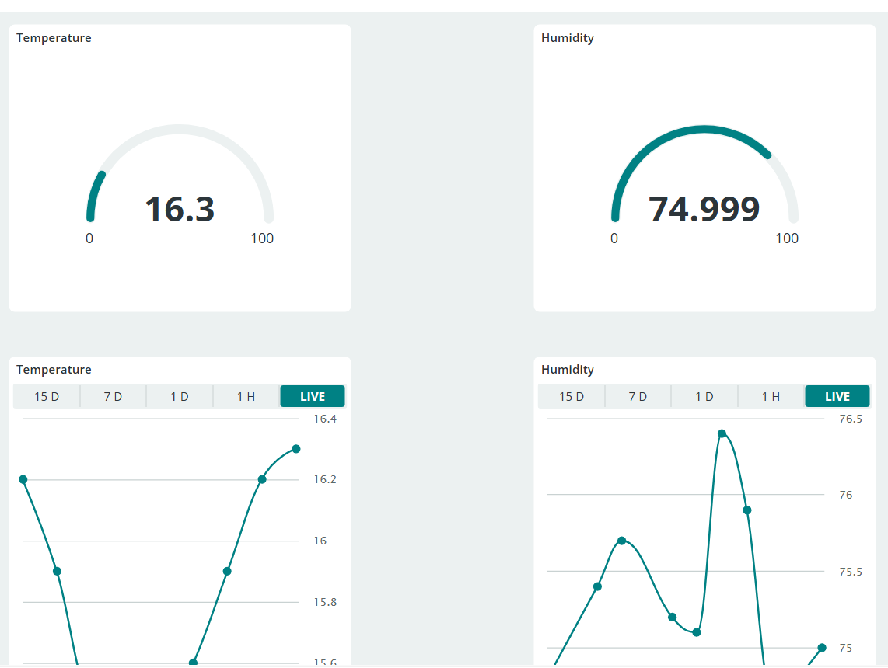

# Air Quality Monitoring (ESP32 + Arduino IoT Cloud)

An IoT air quality monitoring system built on an ESP32 Dev Module,
streaming live temperature, humidity, and air quality data to an
Arduino IoT Cloud dashboard.

## Demo

## Overview

This project reads gas concentration data from an MQ-135 sensor and
temperature/humidity data from a DHT11 sensor, publishing both to
Arduino IoT Cloud in real time. The cloud dashboard displays three
live gauges (Temperature, Humidity, Air Quality) plus historical
charts.

## Hardware

| Component            | Notes                                   |
|-----------------------|------------------------------------------|
| ESP32 Dev Module (30-pin) | Main microcontroller, WiFi + Cloud connection |
| MQ-135 Gas Sensor     | Analog air quality / gas concentration sensor |
| DHT11 Temp/Humidity Sensor | Digital temperature & humidity sensor |

## Wiring

| Sensor  | Pin  | ESP32 Pin |
|---------|------|-----------|
| MQ-135  | VCC  | VIN (5V)  |
| MQ-135  | GND  | GND       |
| MQ-135  | AOUT | GPIO34    |
| DHT11   | VCC  | 3V3       |
| DHT11   | GND  | GND       |
| DHT11   | DATA | GPIO5     |

## Setup

1. Install the ESP32 board package in Arduino IDE (or use Arduino
   Cloud Editor).
2. Install the `DHT sensor library` by Adafruit.
3. Copy `arduino_secrets_TEMPLATE.h` to `arduino_secrets.h` and fill
   in your own WiFi credentials and Arduino Cloud device key.
4. Create a matching "Thing" in Arduino IoT Cloud with these Cloud
   Variables: `message` (String), `airquality` (CloudPercentage),
   `humidity` (CloudPercentage), `temperature` (CloudTemperature).
   This auto-generates your own `thingProperties.h`.
5. Upload `Air_Quality_Monitoring.ino` to the ESP32.
6. Open the Arduino Cloud dashboard to view live data.

## Development Notes

- ESP32 only supports 2.4GHz WiFi. If your router broadcasts a
  single merged SSID for both 2.4GHz and 5GHz (common with WiFi 6
  routers using band steering), the board may fail to connect since
  the router can steer it toward 5GHz. Splitting the router's SSID
  into separate 2.4GHz/5GHz names resolves this.

## License

MIT
